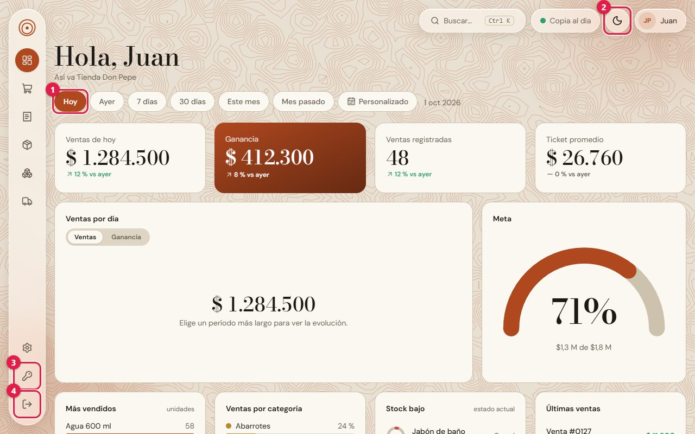
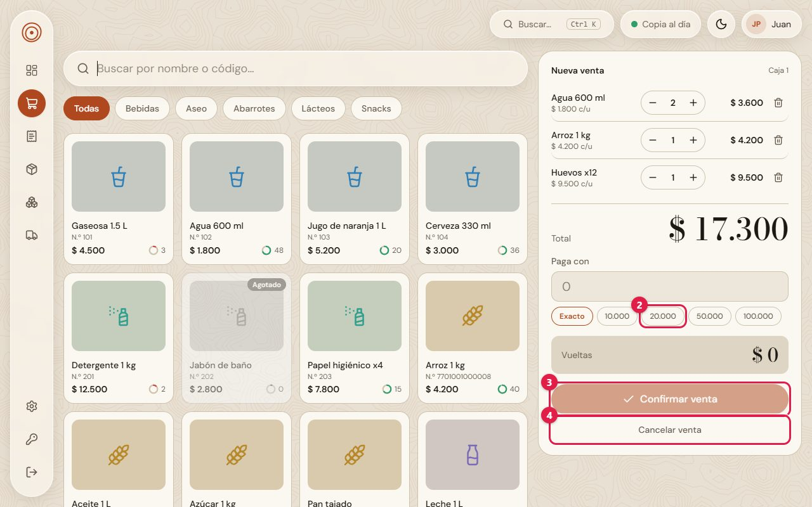
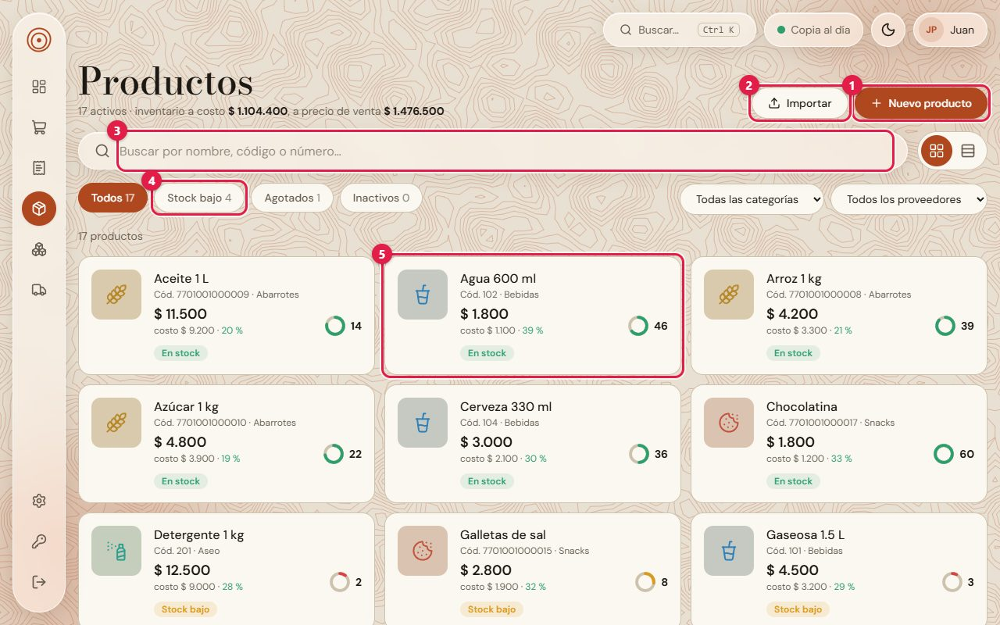
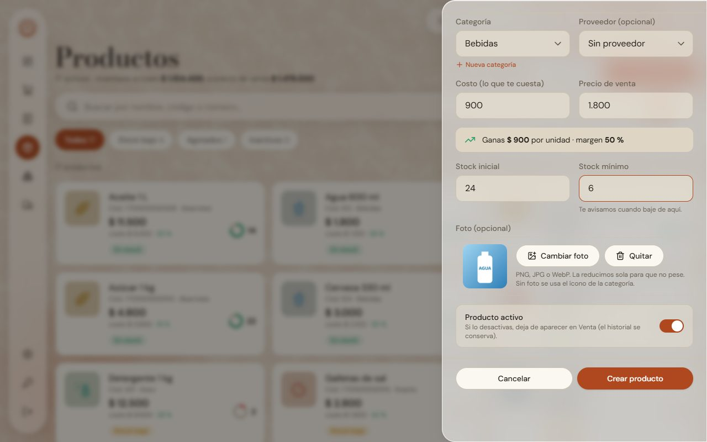
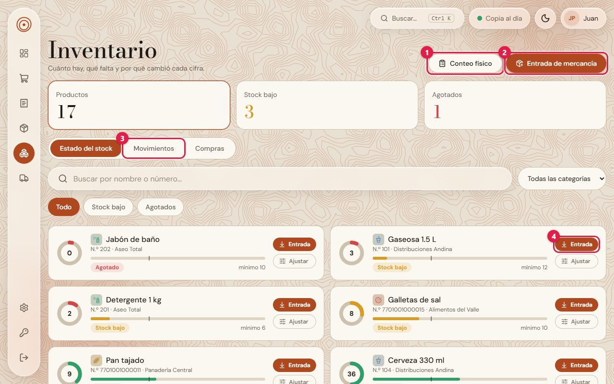
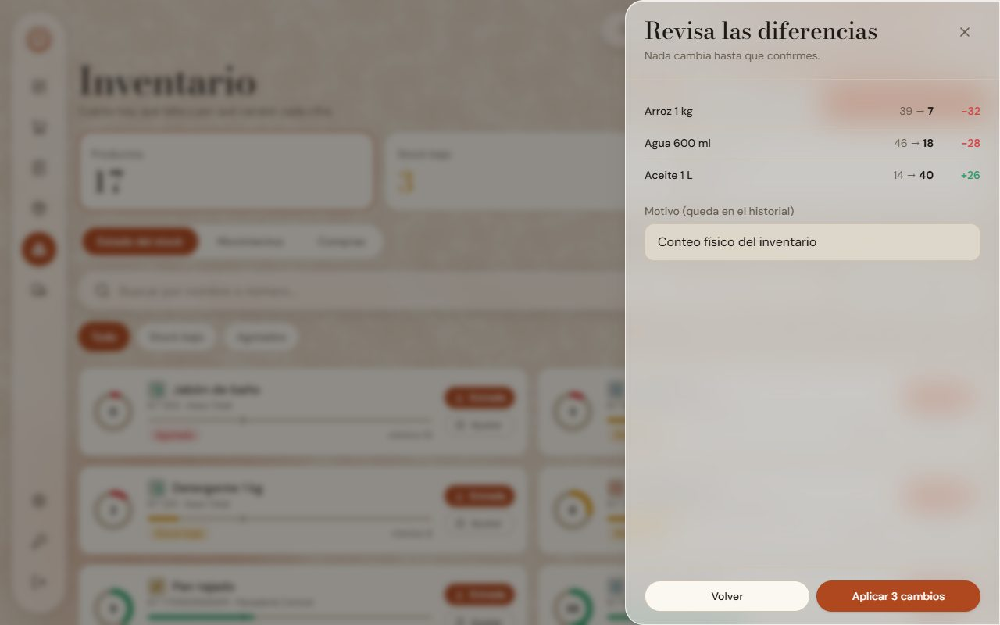
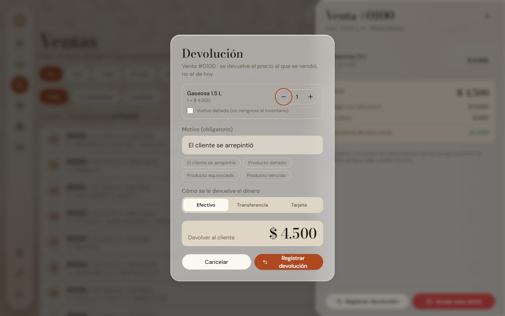
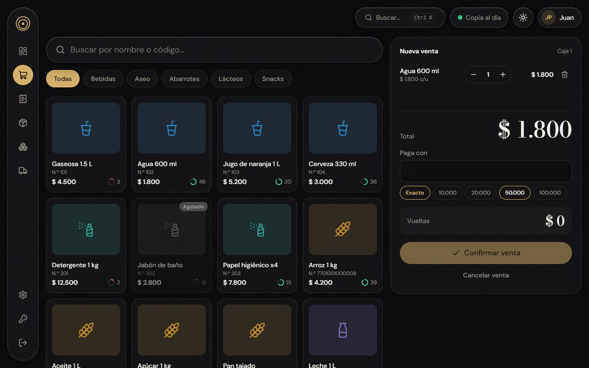
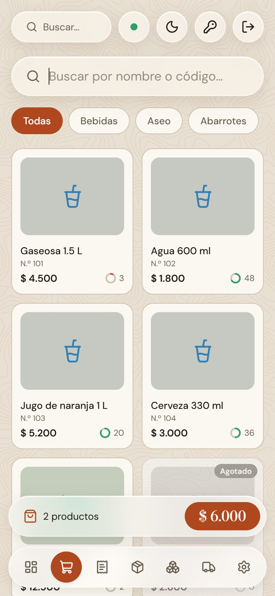

# Nivel · Demo

**Nivel** es un sistema de **ventas, inventario y ganancias** para tiendas y pequeños negocios, pensado para usarse todos los días y rápido: en el computador del mostrador, en una tablet o en el celular, con **modo claro y oscuro**.

Este repositorio es la **demo pública**: la pantalla completa funcionando con **datos de ejemplo en memoria** (sin servidor ni base de datos), para poder recorrer el producto sin instalar nada.

> 🔗 **Demo en vivo:** `https://TU-USUARIO.github.io/nivel-demo/` *(reemplaza TU-USUARIO por tu usuario de GitHub cuando actives GitHub Pages)*
>
> Para entrar escribe **cualquier usuario y contraseña**. Los datos se reinician al recargar la página.

## Capturas
| Panel del dueño | Venta (caja) |
| --- | --- |
|  |  |

| Productos | Nuevo producto con foto |
| --- | --- |
|  |  |

| Inventario | Conteo físico |
| --- | --- |
|  |  |

| Devolución de un cliente | Modo oscuro |
| --- | --- |
|  |  |



## Qué puedes probar en la demo
- **Venta:** buscar por nombre o código, armar el carrito, cobrar con vueltas y billetes rápidos, y registrar la venta (el stock baja de verdad dentro de la demo).
- **Ventas:** historial con filtros, detalle, **anulación** y **devoluciones** parciales (con producto dañado o en buen estado).
- **Productos:** crear y editar con foto, descripción, código propio o automático, categoría (incluso una nueva sin salir del formulario), proveedor, costo y precio con el **margen calculado en vivo**.
- **Inventario:** estado del stock, **entradas de mercancía**, ajustes y **conteo físico masivo** con revisión de diferencias.
- **Proveedores:** qué pedirle a cada uno y **devolución de mercancía** (llegó de más, dañada, vencida).
- **Panel:** ventas, ganancia, más vendidos y categorías con filtros de período y comparación.
- **Configuración:** negocio, categorías, usuarios y roles, apariencia (color y patrón de fondo).
- Diseño **responsive** (celular, tablet y escritorio), **modo claro/oscuro**, avisos y diálogos propios (sin `alert` del navegador).

## Cómo está construido
- **React 19 + TypeScript + Vite + Tailwind CSS v4**, react-hook-form + Zod para formularios, Recharts para las gráficas.
- **Dos modos detrás de un mismo contrato** (`Catalogo`): *demo* (datos en memoria, este repositorio) y *real* (API + PostgreSQL). Las pantallas solo conocen la interfaz, así que el mismo código sirve para los dos.
- **Reglas de negocio como funciones puras con pruebas** (`src/lib`): cálculo de venta y vueltas, búsqueda, inventario y conteo, devoluciones, períodos del panel, fuerza de contraseña… **131 pruebas** con Vitest.
- **Decisiones de diseño:** una sola fuente de verdad para las reglas (la pantalla solo muestra), dinero en pesos enteros, precios y costos copiados en cada venta (lo ya vendido nunca cambia), protección contra doble clic al confirmar una venta.

## Ejecutarlo en tu computador
Requisitos: Node.js 20 o superior.
```bash
npm install
npm run dev      # http://localhost:5173
npm test         # pruebas de las reglas de negocio
npm run build    # genera la carpeta dist/
```

## Publicarlo en GitHub Pages
1. Sube este repositorio a GitHub con el nombre `nivel-demo` (rama `main`).
2. En *Settings → Pages → Build and deployment → Source* elige **GitHub Actions**.
3. El flujo `.github/workflows/pages.yml` prueba, compila y publica la demo solo en cada cambio.

## Sobre el proyecto completo
La versión completa de Nivel (servidor Node + Express, base de datos PostgreSQL con Prisma, usuarios y permisos por rol, devoluciones, copias de seguridad verificadas con restauración, reporte semanal por correo e instalador para Windows) es un producto aparte; esta demo muestra únicamente su interfaz. Si quieres conocer el proyecto completo, escríbeme.

---
Hecho por **Juan Sebastián Pulido Bojaca**.
